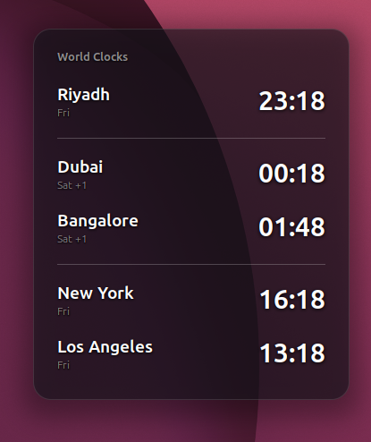
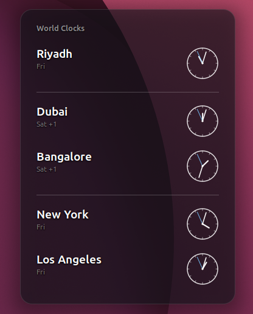

# World Clocks (Desktop)

A GNOME Shell extension that pins multiple world clocks to your desktop.
Digital or analog, grouped into sections, with configurable cities and
position.

<p align="center">
  
  &nbsp;&nbsp;
  
</p>
<p align="center"><em>Digital and analog modes.</em></p>

## Features

- Multiple clocks, each on its own IANA timezone (e.g. `Asia/Riyadh`).
- **Digital** or **analog** display (global toggle).
- Weekday label per clock, with a `+1` / `-1` tag when a city is on a
  different calendar day than you.
- **Section dividers** to group cities.
- **Layer**: `desktop` (behind windows, visible on the desktop) or
  `overlay` (always on top).
- Anchor to any corner, with adjustable margins.

## Install

### From extensions.gnome.org

Search for "World Clocks (Desktop)" in the
[GNOME Extensions](https://extensions.gnome.org) site or in the
Extensions Manager app.

### Manual

```sh
make install
```

Then log out and back in, and enable it:

```sh
gnome-extensions enable worldclocks@seifhawamdeh.github.io
```

## Configure

Open the preferences:

```sh
gnome-extensions prefs worldclocks@seifhawamdeh.github.io
```

Or use the settings button in the Extensions Manager app. You can add and
remove clocks, insert dividers, switch digital/analog, pick the layer, and
set the anchor corner and margins.

Timezones use IANA IDs — the same list as `timedatectl list-timezones`.

## Development

The main clock logic lives in [`extension.js`](extension.js); the settings
UI is in [`prefs.js`](prefs.js); persisted settings are declared in
[`schemas/`](schemas/).

```sh
make pack     # build a distributable zip
make install  # install into ~/.local/share/gnome-shell/extensions
```

On Wayland, changes to `extension.js` require a full log out / log in to
take effect (the shell caches extension modules for the session). On X11,
restart the shell with Alt+F2 → `r`.

## Compatibility

GNOME Shell 45–50.

## License

MIT — see [LICENSE](LICENSE).
